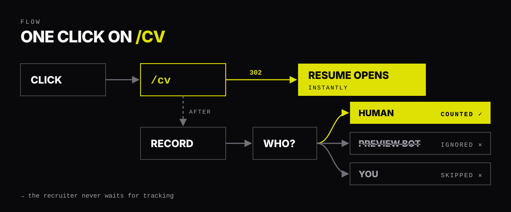
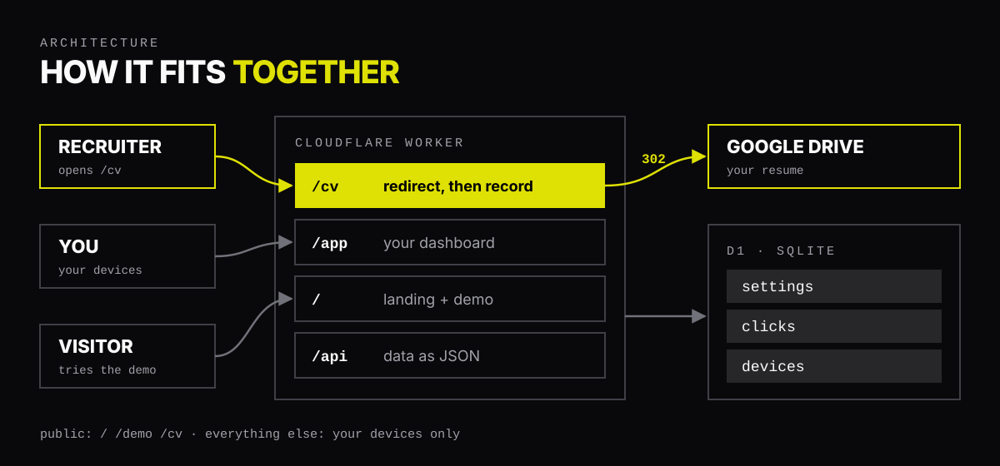
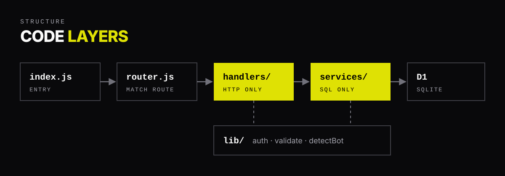

<div align="center">


# Pingback

### You sent your resume. Did they open it?

One permanent link to your resume that counts **real** opens,
and ignores link-preview bots and your own clicks.

**[Try the live demo →](https://pingback.air01aditya.workers.dev)**


</div>

---

## The problem

You apply to 50 roles and hear back from 3. The other 47 go silent, and you can't tell
whether your resume was rejected or never opened at all.

A normal click counter won't tell you either. The moment you paste a link into LinkedIn,
WhatsApp or Slack, a **bot opens it first** to build a preview card. So the counter says
"opened" before any person has seen it.

## What Pingback does

Share one link everywhere you apply: `pingback.air01aditya.workers.dev/cv`

It opens your Google Drive resume instantly, and every visit is sorted:

| Visit | Example | Counted? |
|---|---|---|
| **Human** | a recruiter in Chrome | ✅ counted |
| **Preview bot** | `LinkedInBot/1.0`, `WhatsApp`, `HEAD` requests | ❌ ignored |
| **You** | your own devices, testing the link | ❌ skipped |

Your dashboard shows the real count, the last open and a 30-day chart.

## Under the hood



- **Redirect first, count second.** The resume opens with a `302` straight away. The visit is
  saved afterwards with `ctx.waitUntil`, so a slow database can never slow down or break a click.
- **`302`, not `301`.** Browsers cache `301`s and would skip the server on the next visit.
- **No passwords.** Each device is set up once and gets a random token in an `HttpOnly`,
  `SameSite=Lax` cookie. Only its SHA-256 hash is stored.
- **Locked down.** The public can only open `/cv` and `/demo`. Cross-site writes are rejected,
  and the pages run under a strict Content Security Policy.
- **Zero runtime dependencies.** Plain JavaScript, its own small router, and about 500 lines
  of server code.
- **Private by default.** It stores browser type and rough city or country only. No IP addresses.



## Project structure



```
src/
├── index.js        # entry: same-origin check, routing, errors
├── router.js       # small method + path router
├── handlers/       # HTTP only: redirect, setup, stats, resume, devices
├── services/       # SQL only: every query lives here
└── lib/            # auth, validation, bot + browser detection
public/             # landing page, dashboard, setup, demo resume
migrations/         # D1 schema
tests/              # node:test against an in-memory SQLite stand-in for D1
```

## API

| Method | Route | Access | What it does |
|---|---|---|---|
| GET | `/cv` | public | Redirect to the resume, then record the visit |
| GET | `/demo` | public | Same, for the sample resume |
| GET | `/api/demo-stats` | public | Demo open count |
| POST | `/api/setup` | setup key | Remember this device |
| GET | `/api/me` | device | Current device, renews its cookie |
| GET | `/api/stats` | device | Opens, last open, last 30 days |
| PUT | `/api/resume` | device | Change where `/cv` points |
| GET | `/api/devices` | device | List remembered devices |
| DELETE | `/api/devices/:id` | device | Remove a device |

## Run it yourself

Needs Node.js 22.13+ and a free Cloudflare account.

```bash
npm install
cp .dev.vars.example .dev.vars     # paste the output of `npm run secret`
npm run db:migrate:local
npm run dev                        # http://localhost:8787
npm test
```

Open `http://localhost:8787/setup#key=<SETUP_SECRET>` once to remember your device, then add
your resume link at `/app`.

## Honest limitations

- **It counts opens, not people.** One recruiter opening it twice counts as two.
- **Bot detection uses the user agent.** A scanner pretending to be Chrome counts as human.
- **The free `workers.dev` address** doesn't have your name in it. A custom domain fixes that.

## License

[MIT](LICENSE)
